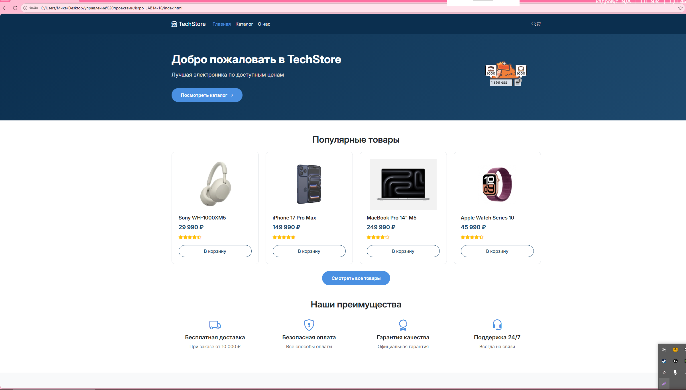
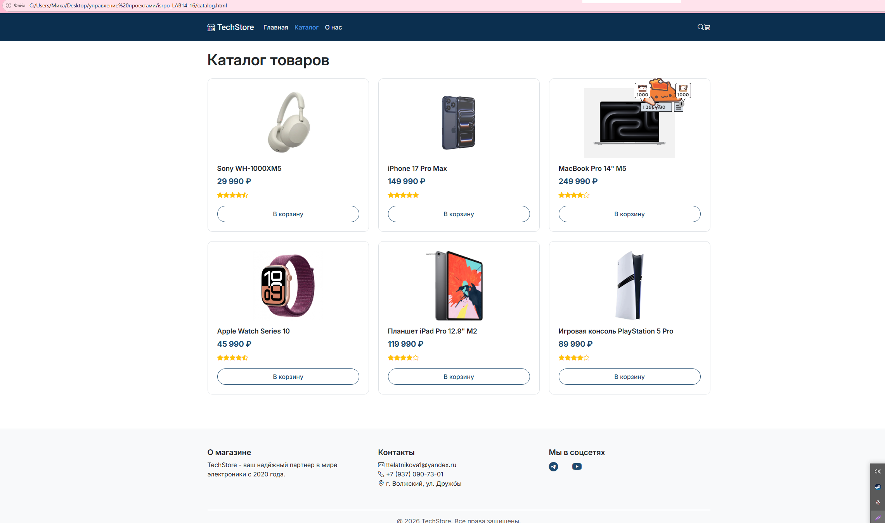
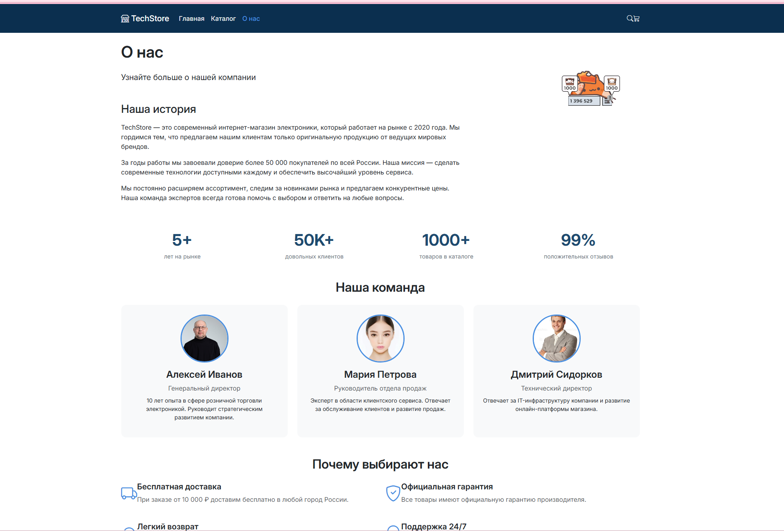

# Лабораторная работа №14-16 - Интернет-магазин "TechStore"

**ФИО:** Иванов Иван Иванович  
**Группа:** ИСП-231  
**Дата:** 20.02.2026  

## Описание проекта

Многостраничный сайт интернет-магазина электроники "TechStore" с адаптивной вёрсткой, выполненный с использованием Bootstrap 5.

## Реализованные страницы

- **Главная** — приветственный баннер, популярные товары, преимущества
- **Каталог** — сетка из 9 карточек товаров с фильтрами
- **О нас** — информация о магазине и команде

## Реализованные функции

- Адаптивное навигационное меню
- Карточки товаров с hover-эффектами
- CSS Grid / Flexbox через Bootstrap для каталога (3 колонки на desktop, 2 на tablet, 1 на mobile)
- Flexbox для навигации и футера
- Адаптивная вёрстка (desktop/tablet/mobile)
- Единая цветовая схема и типографика
- Семантическая HTML5-разметка
- Интерактивные элементы (кнопки, ссылки)

## Технологии

- HTML5
- CSS3
- Bootstrap 5
- Bootstrap Icons
- Google Fonts (Inter)
- Git/GitHub

## Скриншоты

Главная страница

Каталог товаров

О нас

## Лицензия

Все права защищены.